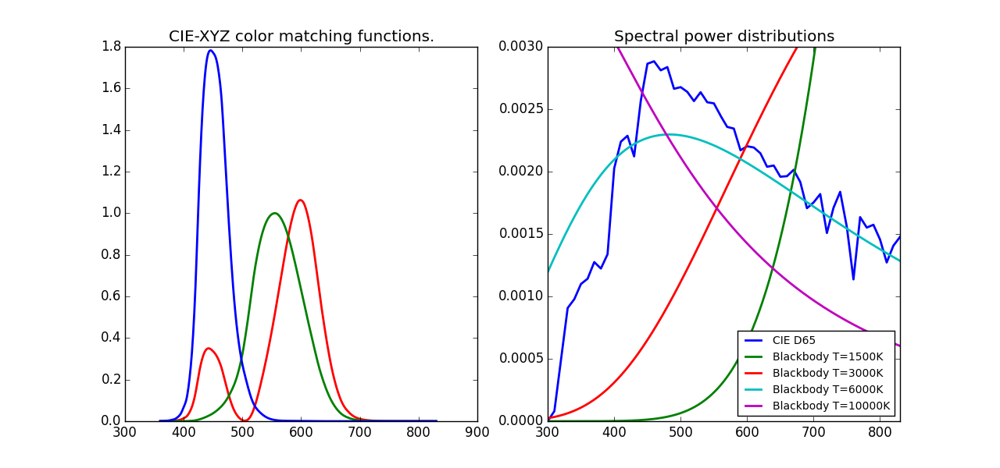
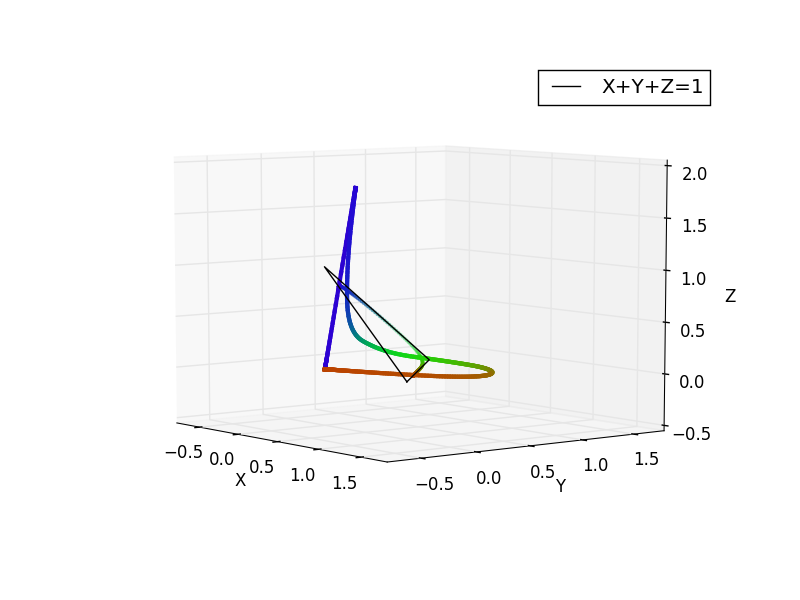
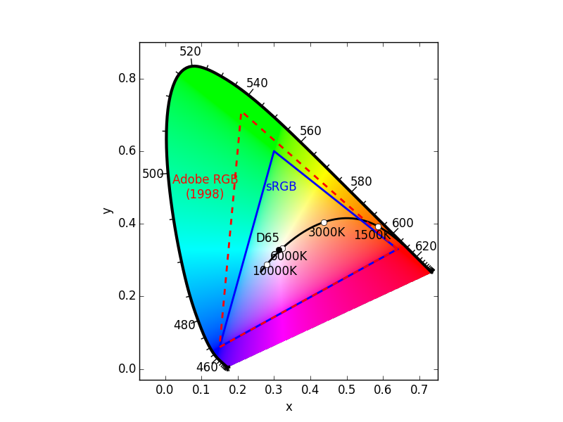

Demos
=====

Show Spectral Functions
-----------------------

Show common spectral functions (`SPD`s and `CMF`s).

Show Monochromatic Curve in 3D
------------------------------

Draw the monochromatic colors of different wavelengths in 3D. This is an
interactive demo.

Show Horseshoe
--------------

Draw the "color horseshoe", with useful quantities annotated on it.

